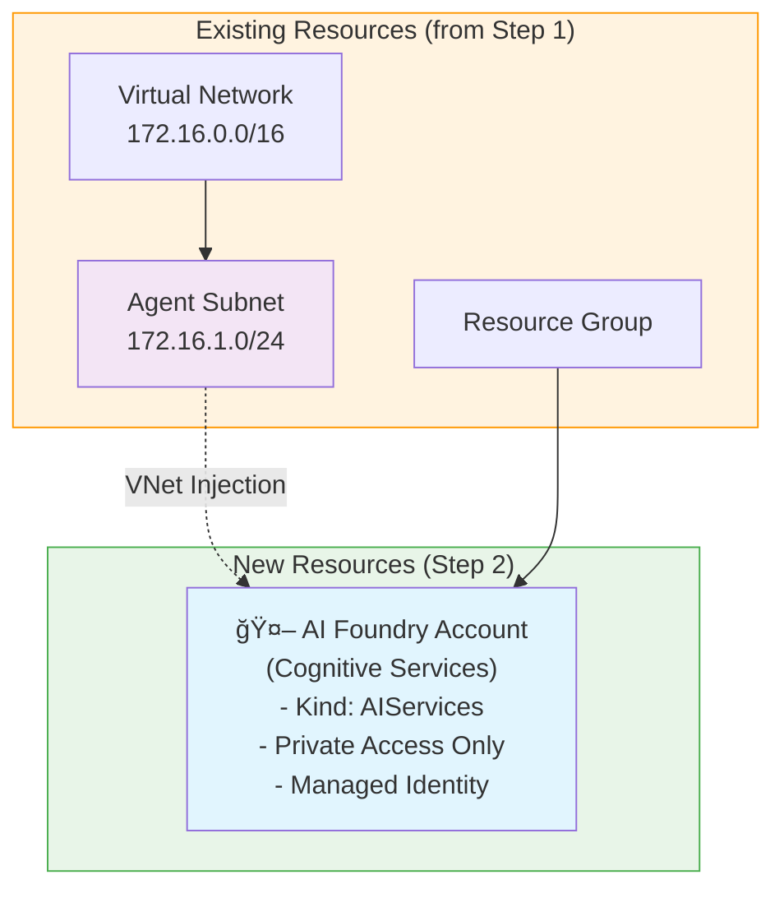

# 🚀 Azure AI Foundry Infrastructure Deployment Guide

This guide will walk you **step by step** through deploying a secure, network-isolated Azure AI Foundry environment using GitHub Actions and Bicep. You’ll learn which **secrets** to create, the **order of GitHub Actions** to run, and what each deployment does.

---

## 1️⃣ Prerequisites & Required Secrets

Before starting, you’ll need to create several **GitHub repository secrets**. These are used by the workflows to authenticate and configure your Azure resources.

### 🔑 **Secrets to Create**

| Secret Name                              | Description                                               | Example Value                        |
|------------------------------------------|-----------------------------------------------------------|--------------------------------------|
| `LOCATION`                              | Azure region for deployment                               | `eastus2`                            |
| `RESOURCE_GROUP_NAME`                    | Resource group for core resources                         | `rg-ai-foundry-resources`            |
| `VNET_RESOURCE_GROUP_NAME`               | Resource group for the VNet                               | `rg-vnet`                            |
| `SUBNET_AGENT_ADDRESS_PREFIX`            | Address prefix for agent subnet                           | `172.16.1.0/24`                      |
| `JUMPBOX_SUBNET_ADDRESS_PREFIX`          | Address prefix for jumpbox subnet                         | `172.16.2.0/24`                      |
| `SUBNET_PRIVATE_ENDPOINT_ADDRESS_PREFIX` | Address prefix for private endpoint subnet                | `172.16.3.0/24`                      |
| `VNET_ADDRESS_PREFIX`                    | Address prefix for the VNet                               | `172.16.0.0/16`                      |
| `SUBNET_APIM_ADDRESS_PREFIX`             | Address prefix for APIM subnet                            | `172.16.4.0/24`                      |
| `WEBFARM_SUBNET_ADDRESS_PREFIX`          | Address prefix for WebApp subnet                          | `172.16.5.0/24`                      |
| `PUBLISHER_EMAIL`                        | Email for APIM publisher                                  | `admin@contoso.com`                  |
| `PUBLISHER_NAME`                         | Name for APIM publisher                                   | `Contoso`                            |
| `VM_PASSWORD`                            | Password for the Windows jumpbox                          | `YourSecurePassword123!`             |
| `VM_ADMIN`                               | Admin username for the Windows jumpbox                    | `azureadmin`                         |
| `PA_TOKEN`                               | GitHub Personal Access Token (for secret creation)        |                                      |
| `AZURE_CREDENTIALS`                      | Azure Service Principal credentials (JSON)                | `{...}`                              |
| `AZURE_SUBSCRIPTION`                     | Azure Subscription ID                                     | `xxxxxxxx-xxxx-xxxx-xxxx-xxxxxxxxxxxx` |

> ⚠️ **Important - Subnet IP Address Limitation:** Azure AI Foundry Agent requires that all subnets use IP address ranges under **172.16.0.0/12** or **192.168.0.0/16**. The example values above use 172.16.0.0/16 to comply with this requirement.

> 💡 **Tip:** To create the Azure Service Principal for `AZURE_CREDENTIALS`, run:
> ```bash
> az ad sp create-for-rbac --name foundry-iac --role contributor --scopes /subscriptions/<your-subscription-id>
> ```

---

## 2️⃣ Step 1: Deploy Core Infrastructure (`core.yml`)

**First, run the `Create Core Resources` GitHub Action.**

### 🏗️ What does it create?

The [`infra/base/main.bicep`](infra/base/main.bicep) file provisions the **core network and foundational resources**:

- **Resource Groups** for VNet and core resources
- **Virtual Network (VNet)** with subnets:
  - Agent subnet
  - Private endpoint subnet
  - Jumpbox subnet
  - APIM subnet
- **Network Security Groups** for subnets
- **Private DNS Zones** for Azure services
- **Windows Jumpbox VM** for debugging
- **Azure Storage Account**
- **Azure CosmosDB Account**
- **Azure AI Search Service**
- **API Management (APIM) Service**
- **Private Endpoints** for secure, private connectivity

### 🗺️ **Architecture Diagram**

```mermaid
flowchart TD
    subgraph RG_VNET["Resource Group (VNet)"]
        VNET["🌐 Virtual Network<br/>vnet-ai"]
        
        subgraph SUBNETS["Subnets"]
            SUBNET_AGENT["Agent Subnet<br/>snet-agent<br/>Delegation: Microsoft.App/environments"]
            SUBNET_PE["Private Endpoint Subnet<br/>snet-pe"]
            SUBNET_JUMPBOX["Jumpbox Subnet<br/>snet-jumpbox"]
            SUBNET_APIM["APIM Subnet<br/>snet-apim"]
            SUBNET_API["Web Farm Subnet<br/>snet-api<br/>Delegation: Microsoft.Web/serverFarms"]
        end
        
        NSG_JUMPBOX["🛡️ NSG<br/>nsg-jumpbox"]
        NSG_APIM["🛡️ NSG<br/>nsg-apim"]
        
        JUMPBOX["💻 Windows Jumpbox VM<br/>Standard_D2s_v3"]
        BUILD_AGENT["🔨 Build Agent VM<br/>Ubuntu 22.04<br/>Standard_D2ls_v5"]
        
        PIP_APIM["📍 Public IP<br/>pip-apim"]
        
        subgraph DNS_ZONES["Private DNS Zones"]
            DNS_BLOB["privatelink.blob.core.windows.net"]
            DNS_COGNITIVE["privatelink.cognitiveservices.azure.com"]
            DNS_COSMOS["privatelink.documents.azure.com"]
            DNS_OPENAI["privatelink.openai.azure.com"]
            DNS_AI_SERVICES["privatelink.services.ai.azure.com"]
            DNS_SEARCH["privatelink.search.windows.net"]
            DNS_ACR["privatelink.azurecr.io"]
            DNS_TABLE["privatelink.table.core.windows.net"]
        end
    end
    
    subgraph RG_RESOURCES["Resource Group (Resources)"]
        APIM["🚪 API Management<br/>apim-{suffix}<br/>Developer SKU<br/>External VNet Mode"]
        SEARCH["🔍 AI Search Service<br/>search-{suffix}<br/>Standard SKU<br/>Private Access Only"]
        STORAGE["💾 Storage Account<br/>str{suffix}<br/>Standard_LRS<br/>Private Access Only"]
        COSMOS["🗄️ CosmosDB Account<br/>cosmos-{suffix}<br/>Private Access Only"]
    end
    
    %% Network relationships
    VNET --> SUBNET_AGENT
    VNET --> SUBNET_PE
    VNET --> SUBNET_JUMPBOX
    VNET --> SUBNET_APIM
    VNET --> SUBNET_API
    
    %% NSG relationships
    NSG_JUMPBOX --> SUBNET_JUMPBOX
    NSG_APIM --> SUBNET_APIM
    
    %% VM relationships
    JUMPBOX --> SUBNET_JUMPBOX
    BUILD_AGENT --> SUBNET_JUMPBOX
    
    %% APIM relationships
    APIM --> SUBNET_APIM
    PIP_APIM --> APIM
    
    %% Private Endpoint relationships
    STORAGE -.->|Private Endpoint| SUBNET_PE
    COSMOS -.->|Private Endpoint| SUBNET_PE
    SEARCH -.->|Private Endpoint| SUBNET_PE
    
    %% DNS Zone relationships
    DNS_BLOB -.->|VNet Link| VNET
    DNS_COGNITIVE -.->|VNet Link| VNET
    DNS_COSMOS -.->|VNet Link| VNET
    DNS_OPENAI -.->|VNet Link| VNET
    DNS_AI_SERVICES -.->|VNet Link| VNET
    DNS_SEARCH -.->|VNet Link| VNET
    DNS_ACR -.->|VNet Link| VNET
    DNS_TABLE -.->|VNet Link| VNET
    
    %% DNS Record relationships
    JUMPBOX -.->|A Records| DNS_ZONES
    BUILD_AGENT -.->|A Records| DNS_ZONES
    
    %% Private DNS Zone to Private Endpoint relationships
    STORAGE -.->|DNS Resolution| DNS_BLOB
    COSMOS -.->|DNS Resolution| DNS_COSMOS
    SEARCH -.->|DNS Resolution| DNS_SEARCH
    
    %% Styling
    style RG_VNET fill:#e3f2fd,stroke:#1976d2,stroke-width:2px
    style RG_RESOURCES fill:#f3e5f5,stroke:#7b1fa2,stroke-width:2px
    style SUBNETS fill:#e8f5e8,stroke:#388e3c
    style DNS_ZONES fill:#fff3e0,stroke:#f57c00
    style VNET fill:#bbdefb
    style APIM fill:#f8bbd9
    style SEARCH fill:#ffcdd2
    style STORAGE fill:#dcedc8
    style COSMOS fill:#ffe0b2
```



### ⚙️ **How to run**

1. **Push your secrets** to the repository.
2. **Trigger** the `core.yml` workflow in GitHub Actions.
3. Wait for completion. The workflow will also **save outputs as new secrets** for the next steps.

### 📤 **Secrets Created by this Workflow**

After successful completion, the following secrets will be automatically created in your repository:

| Secret Name | Description | Source |
|-------------|-------------|---------|
| `RESOURCE_GROUP_NAME` | Name of the core resources resource group | Bicep output |
| `LOCATION` | Azure region where resources were deployed | Bicep output |
| `VNET_RESOURCE_NAME` | Name of the Virtual Network | Bicep output |
| `VNET_RESOURCE_GROUP_NAME` | Resource group containing the VNet | Bicep output |
| `SUBNET_AGENT_RESOURCE_NAME` | Name of the agent subnet | Bicep output |
| `SUBNET_AGENT_ID` | Resource ID of the agent subnet | Bicep output |
| `SUBNET_PRIVATE_ENDPOINT_ID` | Resource ID of the private endpoint subnet | Bicep output |
| `SUBNET_PRIVATE_ENDPOINT_RESOURCE_NAME` | Name of the private endpoint subnet | Bicep output |
| `AI_SERVICES_PRIVATE_DNS_ZONE_RESOURCE_NAME` | Name of AI Services private DNS zone | Bicep output |
| `COGNITIVE_SERVICES_PRIVATE_DNS_ZONE_RESOURCE_NAME` | Name of Cognitive Services private DNS zone | Bicep output |
| `OPEN_AI_PRIVATE_DNS_ZONE_RESOURCE_NAME` | Name of OpenAI private DNS zone | Bicep output |
| `PRIVATE_DNS_RESOURCE_GROUP_NAME` | Resource group containing private DNS zones | Bicep output |
| `AI_SEARCH_RESOURCE_NAME` | Name of the Azure AI Search service | Bicep output |
| `AZURE_COSMOS_DB_ACCOUNT_RESOURCE_NAME` | Name of the CosmosDB account | Bicep output |
| `STORAGE_ACCOUNT_RESOURCE_NAME` | Name of the storage account | Bicep output |
| `PRIVATE_DNS_REGISTRY_RESOURCE_ID` | Resource ID of the container registry private DNS zone | Bicep output |
| `SUBNET_ACA_RESOURCE_ID` | Resource ID of the Azure Container Apps subnet | Bicep output |
| `TABLE_STORAGE_PRIVATE_DNS_ZONE_RESOURCE_ID` | Resource ID of the table storage private DNS zone | Bicep output |
| `COSMOSDB_PRIVATE_DNS_ZONE_RESOURCE_ID` | Resource ID of the CosmosDB private DNS zone | Bicep output |

> 💡 **Note:** These secrets are automatically created by the workflow and will be used by subsequent deployment steps (foundry.yml and project.yml).

---

## 3️⃣ Step 2: Deploy AI Foundry Resource (`foundry.yml`)

**Next, run the `Create AI Foundry Resource` GitHub Action.**

### 🤖 What does it create?

The [`infra/foundry/main.bicep`](infra/foundry/main.bicep) file provisions the **Azure AI Foundry account**:

- **AI Foundry Account** (Cognitive Services, kind: `AIServices`)
- **VNet Injection** for network isolation (uses agent subnet)
- **System-assigned Managed Identity**
- **Disables public network access** (private only)

### �️ **Architecture Diagram**



### �🗝️ **Secrets Used**

- `LOCATION`
- `SUBNET_AGENT_ID`
- `RESOURCE_GROUP_NAME`

### ⚙️ **How to run**

1. Ensure the previous workflow completed and secrets are available.
2. **Trigger** the `foundry.yml` workflow in GitHub Actions.
3. Wait for completion. The workflow will **save the Foundry resource name as a secret**.

---

## 4️⃣ Step 3: Deploy AI Foundry Project (`project.yml`)

**Finally, run the `project.yml` GitHub Action.**

### 📦 What does it create?

The [`infra/project/main.bicep`](infra/project/main.bicep) file provisions the **AI Foundry Project** and connects it to your existing resources:

- **AI Foundry Project** (with display name & description)
- **Connections** to:
  - CosmosDB (thread storage)
  - Azure Storage (agent data)
  - AI Search (vector storage)
- **Capability Host** for agent operations
- **RBAC Role Assignments** for secure access to resources
- **Private endpoints and DNS integration**

### 🗝️ **Secrets Used**

- `LOCATION`
- `AI_SEARCH_RESOURCE_NAME`
- `AZURE_COSMOS_DB_ACCOUNT_RESOURCE_NAME`
- `FOUNDRY_RESOURCE_NAME`
- `STORAGE_ACCOUNT_RESOURCE_NAME`
- `RESOURCE_GROUP_NAME`
- (Project-specific inputs: name, display name, description)

### ⚙️ **How to run**

1. Ensure all previous workflows completed and secrets are available.
2. **Trigger** the `project.yml` workflow in GitHub Actions.
3. Provide the required project inputs (name, display name, description).

---

## 🏗️ **Complete Architecture Overview**

This diagram shows all resources created across the three deployment phases:

```mermaid
flowchart TD
    subgraph PHASE1["Phase 1: Core Infrastructure (core.yml)"]
        subgraph RG_VNET["Resource Group (VNet)"]
            VNET["🌐 Virtual Network<br/>vnet-ai<br/>172.16.0.0/16"]
            
            subgraph SUBNETS["Subnets"]
                SUBNET_AGENT["🔗 Agent Subnet<br/>snet-agent<br/>172.16.1.0/24<br/>Delegation: Microsoft.App/environments"]
                SUBNET_PE["🔌 Private Endpoint Subnet<br/>snet-pe<br/>172.16.3.0/24"]
                SUBNET_JUMPBOX["🖥️ Jumpbox Subnet<br/>snet-jumpbox<br/>172.16.2.0/24"]
                SUBNET_APIM["🚪 APIM Subnet<br/>snet-apim<br/>172.16.4.0/24"]
                SUBNET_API["🌐 Web Farm Subnet<br/>snet-api<br/>172.16.5.0/24<br/>Delegation: Microsoft.Web/serverFarms"]
            end
            
            NSG_JUMPBOX["🛡️ NSG<br/>nsg-jumpbox"]
            NSG_APIM["🛡️ NSG<br/>nsg-apim<br/>APIM Management Rules"]
            
            JUMPBOX["💻 Windows Jumpbox VM<br/>Standard_D2s_v3<br/>Auto-shutdown: 23:59 UTC"]
            BUILD_AGENT["🔨 Build Agent VM<br/>Ubuntu 22.04<br/>Standard_D2ls_v5<br/>Auto-shutdown: 23:59 UTC"]
            
            PIP_APIM["📍 Public IP<br/>pip-apim"]
            
            subgraph DNS_ZONES["Private DNS Zones"]
                DNS_BLOB["🔗 privatelink.blob.core.windows.net"]
                DNS_COGNITIVE["🧠 privatelink.cognitiveservices.azure.com"]
                DNS_COSMOS["🗄️ privatelink.documents.azure.com"]
                DNS_OPENAI["🤖 privatelink.openai.azure.com"]
                DNS_AI_SERVICES["⚡ privatelink.services.ai.azure.com"]
                DNS_SEARCH["🔍 privatelink.search.windows.net"]
                DNS_ACR["📦 privatelink.azurecr.io"]
                DNS_TABLE["📊 privatelink.table.core.windows.net"]
            end
        end
        
        subgraph RG_RESOURCES["Resource Group (Resources)"]
            APIM["🚪 API Management<br/>apim-{suffix}<br/>Developer SKU<br/>External VNet Mode"]
            SEARCH["🔍 AI Search Service<br/>search-{suffix}<br/>Standard SKU<br/>Private Access Only"]
            STORAGE["💾 Storage Account<br/>str{suffix}<br/>Standard_LRS<br/>Private Access Only"]
            COSMOS["🗄️ CosmosDB Account<br/>cosmos-{suffix}<br/>Private Access Only<br/>No Local Auth"]
        end
    end
    
    subgraph PHASE2["Phase 2: AI Foundry Account (foundry.yml)"]
        FOUNDRY["🤖 AI Foundry Account<br/>(Cognitive Services)<br/>- Kind: AIServices<br/>- Private Access Only<br/>- Managed Identity<br/>- VNet Injected"]
    end
    
    subgraph PHASE3["Phase 3: AI Foundry Project (project.yml)"]
        PROJECT["📦 AI Foundry Project<br/>- Display Name<br/>- Description<br/>- Connections to all services"]
        CAPABILITY_HOST["⚡ Capability Host<br/>Agent Operations"]
        RBAC_ASSIGNMENTS["🔐 RBAC Assignments<br/>- Storage Blob Data Contributor<br/>- Search Index Data Contributor<br/>- CosmosDB Data Contributor"]
    end
    
    %% Phase 1 Network relationships
    VNET --> SUBNET_AGENT
    VNET --> SUBNET_PE
    VNET --> SUBNET_JUMPBOX
    VNET --> SUBNET_APIM
    VNET --> SUBNET_API
    
    %% NSG relationships
    NSG_JUMPBOX --> SUBNET_JUMPBOX
    NSG_APIM --> SUBNET_APIM
    
    %% VM relationships
    JUMPBOX --> SUBNET_JUMPBOX
    BUILD_AGENT --> SUBNET_JUMPBOX
    
    %% APIM relationships
    APIM --> SUBNET_APIM
    PIP_APIM --> APIM
    
    %% Private Endpoint relationships
    STORAGE -.->|Private Endpoint<br/>Blob Service| SUBNET_PE
    COSMOS -.->|Private Endpoint<br/>SQL API| SUBNET_PE
    SEARCH -.->|Private Endpoint| SUBNET_PE
    
    %% DNS Zone relationships
    DNS_BLOB -.->|VNet Link| VNET
    DNS_COGNITIVE -.->|VNet Link| VNET
    DNS_COSMOS -.->|VNet Link| VNET
    DNS_OPENAI -.->|VNet Link| VNET
    DNS_AI_SERVICES -.->|VNet Link| VNET
    DNS_SEARCH -.->|VNet Link| VNET
    DNS_ACR -.->|VNet Link| VNET
    DNS_TABLE -.->|VNet Link| VNET
    
    %% DNS Record relationships
    JUMPBOX -.->|A Records in all zones| DNS_ZONES
    BUILD_AGENT -.->|A Records in all zones| DNS_ZONES
    
    %% Private DNS Zone to Private Endpoint relationships
    STORAGE -.->|DNS Resolution| DNS_BLOB
    STORAGE -.->|DNS Resolution| DNS_TABLE
    COSMOS -.->|DNS Resolution| DNS_COSMOS
    SEARCH -.->|DNS Resolution| DNS_SEARCH
    
    %% Phase 2 relationships
    SUBNET_AGENT -.->|VNet Injection| FOUNDRY
    RG_RESOURCES --> FOUNDRY
    FOUNDRY -.->|DNS Resolution| DNS_COGNITIVE
    FOUNDRY -.->|DNS Resolution| DNS_OPENAI
    FOUNDRY -.->|DNS Resolution| DNS_AI_SERVICES
    
    %% Phase 3 relationships
    FOUNDRY --> PROJECT
    PROJECT --> CAPABILITY_HOST
    PROJECT -.->|Connection| STORAGE
    PROJECT -.->|Connection| COSMOS
    PROJECT -.->|Connection| SEARCH
    PROJECT --> RBAC_ASSIGNMENTS
    RBAC_ASSIGNMENTS -.->|Access Control| STORAGE
    RBAC_ASSIGNMENTS -.->|Access Control| COSMOS
    RBAC_ASSIGNMENTS -.->|Access Control| SEARCH
    
    %% Styling
    style PHASE1 fill:#e3f2fd,stroke:#1976d2,stroke-width:3px
    style PHASE2 fill:#e8f5e8,stroke:#4caf50,stroke-width:3px
    style PHASE3 fill:#fff3e0,stroke:#ff9800,stroke-width:3px
    style RG_VNET fill:#f3e5f5,stroke:#7b1fa2,stroke-width:2px
    style RG_RESOURCES fill:#e1f5fe,stroke:#0277bd,stroke-width:2px
    style SUBNETS fill:#e8f5e8,stroke:#388e3c
    style DNS_ZONES fill:#fff3e0,stroke:#f57c00
    style VNET fill:#bbdefb
    style APIM fill:#f8bbd9
    style SEARCH fill:#ffcdd2
    style STORAGE fill:#dcedc8
    style COSMOS fill:#ffe0b2
    style FOUNDRY fill:#c8e6c9
    style PROJECT fill:#ffe0b2
    style CAPABILITY_HOST fill:#ffccbc
    style RBAC_ASSIGNMENTS fill:#f8bbd9
```



---

## 📝 **Summary Table**

| Step | Workflow      | What it Deploys                                      | Run Order |
|------|--------------|------------------------------------------------------|-----------|
| 1    | `core.yml`   | Core network, DNS, storage, CosmosDB, search, jumpbox| 1st       |
| 2    | `foundry.yml`| AI Foundry account (private, VNet-injected)          | 2nd       |
| 3    | `project.yml`| AI Foundry project, connections, RBAC, capability host| 3rd       |

---

## 🛡️ **Security & Best Practices**

- **No public access**: All resources are network-isolated.
- **Private endpoints**: Used for all service connectivity.
- **Managed identities**: Used for secure, passwordless access.
- **RBAC**: Least-privilege roles assigned automatically.

---

## 🧹 **Cleanup**

To remove all resources, delete the resource groups or use the corresponding destroy workflows.

---

## 📚 **References**

- [infra/base/main.bicep](infra/base/main.bicep)
- [infra/foundry/main.bicep](infra/foundry/main.bicep)
- [infra/project/main.bicep](infra/project/main.bicep)
- [GitHub Actions Workflows](.github/workflows/)

---

Happy