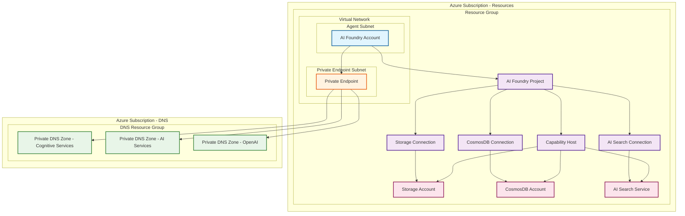

# Azure AI Foundry with Agent BYOD Network Infrastructure

This Terraform configuration provisions an Azure AI Foundry environment with network-secured deployed agents, utilizing a Bring Your Own Data (BYOD) network architecture. The infrastructure includes AI Foundry resources, private endpoints, and connections to existing Azure services.

## Architecture Overview



## Prerequisites

Before deploying this infrastructure, ensure you have:

1. **Azure CLI** installed and configured
2. **Terraform** (version >= 1.8.3) installed
3. **Appropriate Azure permissions** for both subscriptions
4. **Existing Azure resources** (VNet, Storage Account, CosmosDB, AI Search)
5. **Private DNS zones** set up in the DNS subscription

## Required Variables

| Variable | Description | Example Value |
|----------|-------------|---------------|
| `subscription_id_resources` | The subscription ID where the resources will be deployed | `"12345678-1234-1234-1234-123456789012"` |
| `subscription_id_private_dns_zones` | The subscription ID where the private DNS zones are hosted | `"87654321-4321-4321-4321-210987654321"` |
| `resource_group_name_dns` | The resource group where all the Private DNS Zones resources are located | `"rg-private-dns-zones"` |
| `private_dns_cognitiveservices_name` | The name of the Azure Private DNS Zone for Cognitive Services | `"privatelink.cognitiveservices.azure.com"` |
| `private_dns_services_ai_name` | The name of the Azure Private DNS Zone for AI Services | `"privatelink.services.ai.azure.com"` |
| `private_dns_openai_name` | The name of the Azure Private DNS Zone for OpenAI Services | `"privatelink.openai.azure.com"` |
| `location` | The Azure region to provision the resources | `"eastus2"` |
| `existing_vnet_name` | The name of the existing VNet that will contain the AI Foundry resources | `"vnet-ai-foundry"` |
| `existing_subnet_agent_name` | The name of the subnet that will contain the agents | `"snet-agents"` |
| `existing_subnet_private_endpoint_name` | The name of the subnet that will contain the private endpoints | `"snet-private-endpoints"` |
| `resource_group_name_resources` | The name of the existing resource group to deploy the resources into | `"rg-ai-foundry-resources"` |
| `existing_storage_account_name` | The name of the existing storage account to use for agent data | `"staiagentdata001"` |
| `existing_cosmosdb_account_name` | The name of the existing CosmosDB account to use for agent data | `"cosmos-ai-agents"` |
| `existing_aisearch_account_name` | The name of the existing AI Search account to use for agent data | `"srch-ai-agents"` |
| `ai_foundry_resource_name` | The name of the AI Foundry resource | `"aif-production-001"` |
| `project_name` | The name of the AI Foundry project | `"ai-agents-project"` |
| `project_display_name` | The display name of the AI Foundry project | `"AI Agents Production Project"` |
| `project_description` | The description of the AI Foundry project | `"Production environment for AI agents with network security"` |

## Deployment Steps

### 1. Clone and Navigate to Directory

```bash
git clone <repository-url>
cd agentBYODNetwork/infra/terraform
```

### 2. Initialize Terraform

```bash
terraform init
```

### 3. Create Variables File

Create a `terraform.tfvars` file with your specific values:

```hcl
# Subscription Configuration
subscription_id_resources          = "12345678-1234-1234-1234-123456789012"
subscription_id_private_dns_zones  = "87654321-4321-4321-4321-210987654321"

# DNS Configuration
resource_group_name_dns                = "rg-private-dns-zones"
private_dns_cognitiveservices_name     = "privatelink.cognitiveservices.azure.com"
private_dns_services_ai_name           = "privatelink.services.ai.azure.com"
private_dns_openai_name                = "privatelink.openai.azure.com"

# Location and Resource Group
location                        = "eastus2"
resource_group_name_resources   = "rg-ai-foundry-resources"

# Network Configuration
existing_vnet_name                      = "vnet-ai-foundry"
existing_subnet_agent_name              = "snet-agents"
existing_subnet_private_endpoint_name   = "snet-private-endpoints"

# Existing Resources
existing_storage_account_name    = "staiagentdata001"
existing_cosmosdb_account_name   = "cosmos-ai-agents"
existing_aisearch_account_name   = "srch-ai-agents"

# AI Foundry Configuration
ai_foundry_resource_name = "aif-production-001"
project_name             = "ai-agents-project"
project_display_name     = "AI Agents Production Project"
project_description      = "Production environment for AI agents with network security"
```

### 4. Plan the Deployment

```bash
terraform plan -var-file="terraform.tfvars"
```

### 5. Apply the Configuration

```bash
terraform apply -var-file="terraform.tfvars"
```

### 6. Verify Deployment

```bash
# Check the state
terraform show

# List all resources
terraform state list
```

## What Gets Created

This Terraform configuration creates the following Azure resources:

### Core AI Foundry Resources
- **AI Foundry Account** with system-assigned managed identity
- **AI Foundry Project** with connections to existing services
- **Capability Host** for agent operations

### Network Security
- **Private Endpoint** for the AI Foundry account
- **Private DNS Zone Groups** linking to existing DNS zones

### Project Connections
- **CosmosDB Connection** for thread storage
- **Storage Account Connection** for agent data
- **AI Search Connection** for vector storage

### Role Assignments
- **Cosmos DB Operator** role for the AI Foundry project
- **Storage Blob Data Contributor** role for storage access
- **Search Index Data Contributor** role for search operations
- **Search Service Contributor** role for search management
- **CosmosDB SQL Role Assignments** for database access

## Network Architecture

The infrastructure implements a secure network architecture with:

1. **VNet Integration**: AI Foundry resources are deployed within existing VNet subnets
2. **Private Endpoints**: All communication uses private endpoints to avoid public internet
3. **DNS Resolution**: Private DNS zones ensure proper name resolution
4. **Network Injection**: Agents are deployed with VNet injection for network security

## Security Features

- **No Public Access**: AI Foundry account has public access disabled
- **Private Connectivity**: All resources communicate through private endpoints
- **Managed Identity**: System-assigned managed identities for secure authentication
- **Role-Based Access**: Least privilege access through Azure RBAC
- **Network Isolation**: Resources are isolated within specified subnets

## Cleanup

To destroy the infrastructure:

```bash
terraform destroy -var-file="terraform.tfvars"
```

## Troubleshooting

### Common Issues

1. **Permission Errors**: Ensure you have appropriate permissions on both subscriptions
2. **Resource Not Found**: Verify all existing resources exist before deployment
3. **Network Issues**: Check subnet configurations and DNS zone settings
4. **Role Assignment Delays**: The configuration includes wait times for role propagation

### Debugging Commands

```bash
# Check Terraform state
terraform state show <resource_name>

# Refresh state
terraform refresh -var-file="terraform.tfvars"

# View detailed logs
export TF_LOG=DEBUG
terraform apply -var-file="terraform.tfvars"
```

## Support

For issues and questions:
1. Check the Terraform logs for detailed error messages
2. Verify Azure resource configurations
3. Ensure all prerequisites are met
4. Review network connectivity and DNS settings

## Important Considerations

Before deploying this infrastructure, please take note of these critical points:

### Subnet Requirements
- **Agent Subnet Size**: The subnet designated for agents (`existing_subnet_agent_name`) must be at least `/24` in size to accommodate the AI Foundry resources and ensure proper network functionality.

### Azure AI Foundry Deletion
- **Purge Before Redeployment**: If you delete an Azure AI Foundry resource, it enters a soft-delete state. You must purge it completely before running the Terraform script again to avoid naming conflicts and deployment failures.

### Project Creation Limitations
- **UI Restrictions**: Projects created through the Azure portal UI cannot leverage your own existing resources (Storage Account, CosmosDB, AI Search) without additional configuration.
- **Terraform Only**: For now, using your own existing resources with AI Foundry projects is only possible through Terraform deployment, not through the Azure portal UI.
- **Capacity Host Requirement**: To use your own resources with AI Foundry projects, you need the Capability Host resource, which this Terraform configuration provides.
- **Resource Connections**: The Terraform deployment creates the necessary connections between your project and existing resources, enabling full functionality that may not be available through the UI alone.